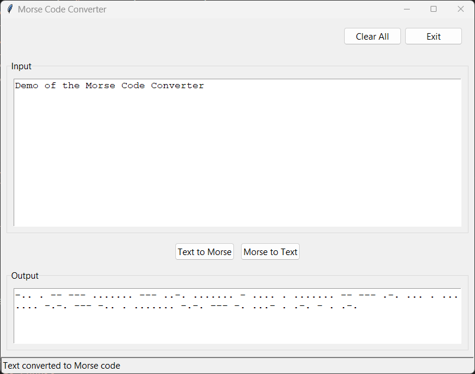

# Morse Code Converter

A Python GUI application to convert between text and Morse code, built using tkinter.

## Features
- Text to Morse code conversion
- Morse code to text conversion
- Simple graphical interface
- Status feedback

## Usage
Run `morse_converter.py` to launch the application.

## License
This project is licensed under the MIT License - see LICENSE file for details.

## Screenshot
